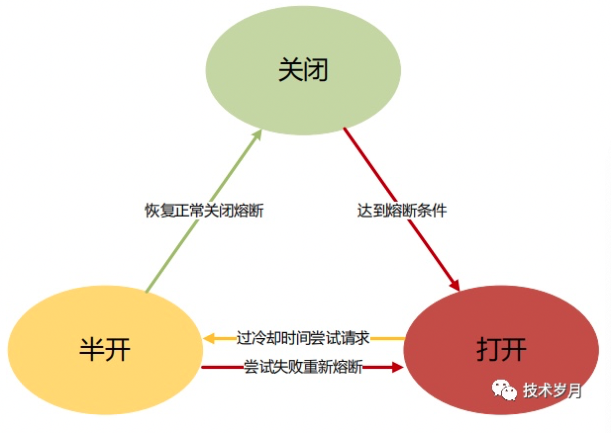

# 熔断器

## 限流

> 防止上游服务调用量过大导致当前服务被压垮

## 熔断

> 预防下游服务出现故障时阻断对下游的调用

## 设计模式

基于AOP对所有请求调用进行拦截，在请求调用前做状态判断是否熔断，请求调用后做计数统计，并根据策略做熔断状态转移

## 设计精髓

## 资料

1. [微服务架构中的熔断器设计与实现](http://note.youdao.com/s/ck6JoF1n)
2. [熔断原理与实现Golang版](https://www.cnblogs.com/kevinwan/p/13889888.html)
